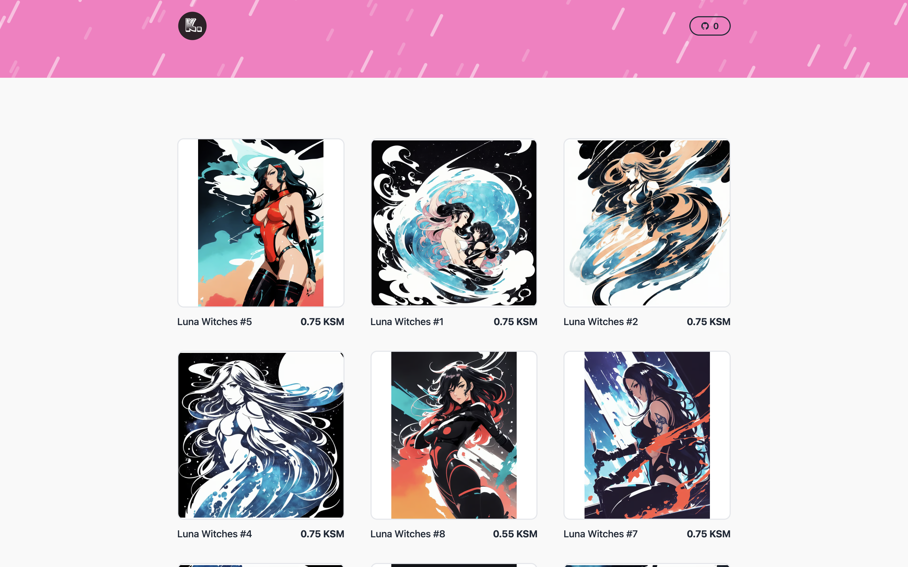
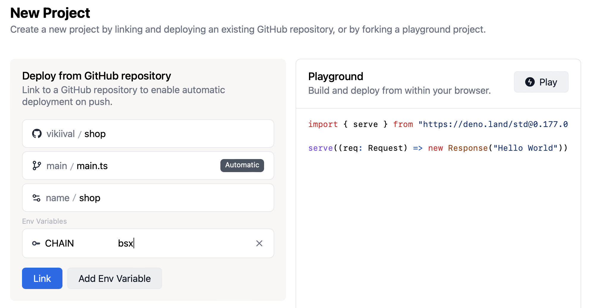

# Kodadot Fandom Shop

Built with [Deno](https://deno.land/) and
[Fresh](https://fresh.deno.dev/), powered by [Uniquery](https://github.com/kodadot/uniquery) and deployed to the edge with [Deno Deploy](https://deno.com/deploy).

This app was built for showcasing [Uniquery](https://github.com/kodadot/uniquery), KodaDot's GraphQL API, for querying data from the blockchain. It's a simple shop that uses Uniquery to fetch NFTs from the blockchain via the [SubSquid indexer](http://subsquid.io).

## Screen Shot



## Develop locally

- Clone the repository
- Set up the `CHAIN` variable in the `.env,` follows `.env.example`.
- Start the project in local mode:
  ```bash
  deno task start
  ```

## Deploy to global

Sign in to [dash.deno.com](https://dash.deno.com), create a new project, and then link to your clone repository version. Please ensure add `CHAIN.` variable:


